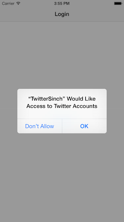
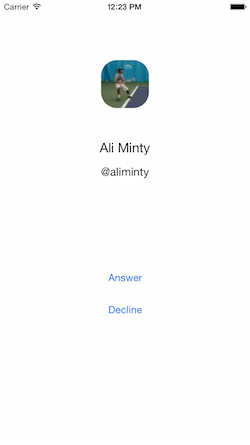
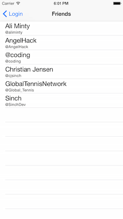
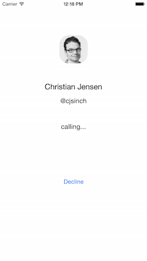

# Build an iOS Twitter App to Call Your Friends

Twitter is a great way to connect people, but it's a shame that users can't connect with voice calling. Sure, you can tag each other or go back and forth with direct messages, but that can get a bit impersonal at times. In this tutorial, we'll be making an app that lets the user call people who they follow on Twitter. We'll do this using Sinch [app-to-app calling](https://www.sinch.com/products/voice-api/app-to-app-calling/) to privately place calls using the user's Twitter username. 

To get the most out of this tutorial, you'll need to be familiar with the following areas:

* XCode
* Objective-C
* CocoaPods
* Accounts and Social Frameworks for iOS

 


## 1. Setup

First, you will want to create an app on you [Sinch Dashboard](https://www.sinch.com/dashboard/). Take note of the application key and secret, as we will need them later.

The starter project for this tutorial can be found on Github. Once you've downloaded that, go ahead and install the necessary pods using CocoaPods with the included **Podfile**. You can do so through Terminal with the command `pod install`. Now there should be an XCode workspace that you can use.

## 2. Twitter Integration

Here is an overview of how we'll set up Twitter in this app. First, we'll request permission to use the Twitter account associated with the user's device. Once this permission has been granted, the user will be presented with a list of people who they follow. Later on we'll let these entries be selectable, and the selected person will be called. 

To start, let's go to **LoginViewController.m**. Locate the method called `ContinueAction`. Go ahead and add to the method body so it looks as follows:

```objective-c
- (IBAction)ContinueAction:(id)sender {
    ACAccountStore *accountStore = [[ACAccountStore alloc] init];
    ACAccountType *accountType = [accountStore accountTypeWithAccountTypeIdentifier:ACAccountTypeIdentifierTwitter];
    [accountStore requestAccessToAccountsWithType:accountType options:nil completion:^(BOOL granted, NSError *error){
        dispatch_async(dispatch_get_main_queue(), ^{
            if (granted) {
                NSArray *accounts = [accountStore accountsWithAccountType:accountType];
                if (accounts.count > 0)
                {
                    ACAccount *twitterAccount = [accounts objectAtIndex:0];
                    
                    // 1
                    
                    [self performSegueWithIdentifier:@"showMaster" sender:twitterAccount];
                    
                }
                else {
                    NSLog(@"no accounts");
                }
            } else {
                NSLog(@"No access granted");
            }
            
        });
    }];
}
```

Here, all we do is request Twitter permissions once the "continue" button is clicked. If there are multiple Twitter accounts on the same device, we just default to the first one. We pass the Twitter account as a sender for a segue so we can use it later on to request a list of people who the user follows.

Now, locate `prepareForSegue:sender:`. We'll need to set the user's Twitter account, so let's add some code to do that:

```objective-c
- (void)prepareForSegue:(UIStoryboardSegue *)segue sender:(id)sender {
    if ([[segue identifier] isEqualToString:@"showMaster"]) {
        [[segue destinationViewController] setTwitterAccount:sender];
    }
}
```

You'll get an error since we don't have a twitterAccount property right now. Let's change that. Add the following property to the interface in **MasterViewController.h**:

```objective-c
@property (strong, nonatomic) ACAccount *twitterAccount;
```

Great, now the user will be asked to grant the app access to Twitter. If access is granted, the app will move to the next screen.

The next step is to get a list of all the user's friends (whoever they follow on Twitter).

Head to **MasterViewController.m**. Let's add a method to get all of the user's friends using a Twitter API request.

```objective-c
- (void) getFriends {
    SLRequest *twitterInfoRequest = [SLRequest requestForServiceType:SLServiceTypeTwitter requestMethod:SLRequestMethodGET URL:[NSURL URLWithString:@"https://api.twitter.com/1.1/friends/ids.json?"] parameters:[NSDictionary dictionaryWithObjectsAndKeys:[NSString stringWithFormat:@"%@", self.twitterAccount.username], @"screen_name", @"-1", @"cursor", nil]];
    [twitterInfoRequest setAccount:self.twitterAccount];

    [twitterInfoRequest performRequestWithHandler:^(NSData *responseData, NSHTTPURLResponse *urlResponse, NSError *error) {
        dispatch_async(dispatch_get_main_queue(), ^{
            // 2
        });
    }];
}
```

This request will give us a list of user ID's for the user's friends. To get that data in an array and fill the table, replace the `// 2` comment with the following code:

```objective-c
            if ([urlResponse statusCode] == 429) {
                NSLog(@"Rate limit reached");
                return;
            }
            if (error) {
                NSLog(@"Error: %@", error.localizedDescription);
                return;
            }
            if (responseData) {
                NSError *error = nil;
                NSDictionary *TWData = [NSJSONSerialization JSONObjectWithData:responseData options:NSJSONReadingMutableLeaves error:&error];
                NSArray *friendList = [TWData valueForKey:@"ids"];
                [self fillTable:friendList];
            }
```

You should get an error, saying that we haven't defined `fillTable`. Now is a great time to define it, so add the following method stub:

```objective-c
- (void) fillTable:(NSArray *) friendList {
	
}
```

Now, add the following for-loop:

```objective-c
    for (NSString *friendID in friendList) {
        SLRequest *twitterInfoRequest = [SLRequest requestForServiceType:SLServiceTypeTwitter requestMethod:SLRequestMethodGET URL:[NSURL URLWithString:@"https://api.twitter.com/1.1/users/lookup.json?"] parameters:[NSDictionary dictionaryWithObjectsAndKeys:[NSString stringWithFormat:@"%@", friendID], @"user_id", nil]];
        [twitterInfoRequest setAccount:self.twitterAccount];
        [twitterInfoRequest performRequestWithHandler:^(NSData *responseData, NSHTTPURLResponse *urlResponse, NSError *error) {
            dispatch_async(dispatch_get_main_queue(), ^{
                // 3
            });
        }];
    }
```

For every friend in the friend list, we'll go ahead and make a request to store that friend's info. To store the info, replace the `// 3` comment with:

```objective-c
                if ([urlResponse statusCode] == 429) {
                    NSLog(@"Rate limit reached");
                    return;
                }
                if (error) {
                    NSLog(@"Error: %@", error.localizedDescription);
                    return;
                }
                if (responseData) {
                    NSError *error = nil;
                    NSDictionary *TWData = [NSJSONSerialization JSONObjectWithData:responseData options:NSJSONReadingMutableLeaves error:&error];
                    
                    CFriend *newFriend = [[CFriend alloc] init];
                    [newFriend setUserID:friendID];
                    [newFriend setName:[[TWData valueForKey:@"name"] objectAtIndex:0]];
                    [newFriend setUsername:[[TWData valueForKey:@"screen_name"] objectAtIndex:0]];
                    [newFriend setPicUrl:[[TWData valueForKey:@"profile_image_url"] objectAtIndex:0]];
                    
                    if (!self.objects) {
                        self.objects = [[NSMutableArray alloc] init];
                    }
                    [self.objects addObject:newFriend];
                    NSIndexPath *indexPath = [NSIndexPath indexPathForRow:_objects.count-1 inSection:0];
                    [self.tableView insertRowsAtIndexPaths:@[indexPath] withRowAnimation:UITableViewRowAnimationAutomatic];
                    [self.tableView reloadData];
                }
```

Here, we store a friend's information in a object. I've gone ahead an defined a class called CFriend for this tutorial.

Now we're ready to call `getFriends` in `viewDidLoad`:

```objective-c
- (void)viewDidLoad {
    [super viewDidLoad];
    [self getFriends];
}
```

Alright, now a list of people who the user follows should appear in the table view.

That's great and all, but let's add a bit of flair to the UI. In some iOS applications, like the Music app, you'll find table views with cells that have subtitiles. Let's do that here. The main text in each table view cell will be the user's name, and the subtext will be the user's username on Twitter.

Find the method named `tabelView:cellForRowAtIndexPath:`. You should see a line that says:

```objective-c
UITableViewCell *cell = [tableView dequeueReusableCellWithIdentifier:@"Cell" forIndexPath:indexPath];
```

Change that to read as follows:

```objective-c
UITableViewCell *cell = [[UITableViewCell alloc] initWithStyle:UITableViewCellStyleSubtitle reuseIdentifier:@"Cell"];
```

Now we'll return a cell that can display subtext. Now, before the return statement, add the following two lines:

```objective-c
[cell.textLabel setFont:[UIFont systemFontOfSize:20]];
cell.detailTextLabel.text = [NSString stringWithFormat:@"@%@", object.username];
```

Now that's better!



So far we've integrated Twitter into our app. Now let's add calling.

## 3. Call Screen and Calling with SinchService

First, go to **DetailViewController.m** and add the following method:

```objective-c
- (void) displayPictureForUrl:(NSString *)urlString {
    NSURL *url = [NSURL URLWithString:urlString];
    NSData *imageData = [NSData dataWithContentsOfURL:url];
    UIImage *img = [UIImage imageWithData:imageData];
    CGSize size = img.size;
    CGRect rectFrame = CGRectMake(self.view.frame.size.width/2 - size.width * 0.75, 90, size.width * 1.5, size.height * 1.5);
    UIImageView* imgv = [[UIImageView alloc] initWithImage:img];
    imgv.frame = rectFrame;
    
    // make picture into circle
    imgv.layer.cornerRadius = size.width/2;
    imgv.layer.masksToBounds = YES;
    
    [self.view addSubview:imgv];
}
```

This is a handy way of displaying a profile picture from a url. Now, locate the method `configureView`. In the if-statement, add the following three lines to display a friend's info:

```objective-c
        self.NameLabel.text = self.callFriend.name;
        self.UsernameLabel.text = [NSString stringWithFormat:@"@%@", self.callFriend.username];
        [self displayPictureForUrl:self.callFriend.picUrl];
```

To display the screen, go back to **MasterViewController.m** and implement this method:

```objective-c
-(void)tableView:(UITableView *)tableView didSelectRowAtIndexPath:(NSIndexPath *)indexPath
{
    DetailViewController *controller = [self.storyboard instantiateViewControllerWithIdentifier:@"callScreen"];
    CFriend *callingFriend = self.objects[indexPath.row];
    [controller setCallFriend:callingFriend];
    // 4
    [self presentViewController:controller animated:YES completion:nil];
}
```

Now we can implement calling. Before we can make any calls, we need to create and initialize a client that will handle calls. 

First, go to **AppDelegate.h** and add the following imports:

```objective-c
#import <Sinch/Sinch.h>
#import <SinchService/SinchService.h>
```
Then, add the following properties to the interface

```objective-c
@property (strong, nonatomic) id<SINService> sinch;
@property (strong, nonatomic) ACAccount *twitterAccount;
```

Now, go to **AppDelegate.m**. Add the **SINServiceDelegate** and **SINCallClientDelegate** protocols to the implementation:

```objective-c
@interface AppDelegate () <SINServiceDelegate, SINCallClientDelegate>
@end
```

Then, add the following code to `application:didFinishLaunchingWithOptions`:

```objective-c
    id config = [SinchService configWithApplicationKey:@"application-key"
                                     applicationSecret:@"application-secret"
                                       environmentHost:@"sandbox.sinch.com"];
    
    id<SINService> sinch = [SinchService serviceWithConfig:config];
    sinch.delegate = self;
    sinch.callClient.delegate = self;
    
    void (^onUserDidLogin)(NSString *) = ^(NSString *userId) {
        [sinch logInUserWithId:userId];
    };
    
    self.sinch = sinch;
    
    [[NSNotificationCenter defaultCenter]
     addObserverForName:@"UserDidLoginNotification"
     object:nil
     queue:nil
     usingBlock:^(NSNotification *note) { onUserDidLogin(note.userInfo[@"userId"]); }];
```

Here, we are initializing the SINService object and setting up NSNotificationCenter. We need to set up NSNotificationCenter so we can log users into the app. We can use their usernames.


Now let's go to **DetailViewController.h**. Go ahead and add the following import:

```objective-c
#import <Sinch/Sinch.h>
```

Then, add two protocols to make the implementation line look like this:

```objective-c
@interface DetailViewController : UIViewController <SINCallClientDelegate, SINCallDelegate>
```

Now add a property that will hold the user's call:

```objective-c
@property (nonatomic, readwrite, strong) id<SINCall> call;
```

In **DetailViewController.m**, add the following setter method to properly set the SINCall property:

```objective-c
- (void)setCall:(id<SINCall>)call {
    _call = call;
    _call.delegate = self;
}
```

Great, now we have a call variable for the call screen, as well as a way to set it. Go back to **AppDelegate.m** and add the following method to handle incoming calls:

```objective-c
- (void)client:(id<SINCallClient>)client didReceiveIncomingCall:(id<SINCall>)call {
    UIViewController *top = self.window.rootViewController;
    SLRequest *twitterInfoRequest = [SLRequest requestForServiceType:SLServiceTypeTwitter requestMethod:SLRequestMethodGET URL:[NSURL URLWithString:@"https://api.twitter.com/1.1/users/lookup.json?"] parameters:[NSDictionary dictionaryWithObjectsAndKeys:[NSString stringWithFormat:@"%@", [call remoteUserId]], @"screen_name", nil]];
    [twitterInfoRequest setAccount:self.twitterAccount];
    [twitterInfoRequest performRequestWithHandler:^(NSData *responseData, NSHTTPURLResponse *urlResponse, NSError *error) {
        dispatch_async(dispatch_get_main_queue(), ^{
            if ([urlResponse statusCode] == 429) {
                NSLog(@"Rate limit reached");
                return;
            }
            if (error) {
                NSLog(@"Error: %@", error.localizedDescription);
                return;
            }
            if (responseData) {
                NSError *error = nil;
                NSDictionary *TWData = [NSJSONSerialization JSONObjectWithData:responseData options:NSJSONReadingMutableLeaves error:&error];
                
                CFriend *callingFriend = [[CFriend alloc] init];
                [callingFriend setUserID:[[TWData valueForKey:@"id"] objectAtIndex:0]];
                [callingFriend setName:[[TWData valueForKey:@"name"] objectAtIndex:0]];
                [callingFriend setUsername:[call remoteUserId]];
                [callingFriend setPicUrl:[[TWData valueForKey:@"profile_image_url"] objectAtIndex:0]];
                
                DetailViewController *controller = [top.storyboard instantiateViewControllerWithIdentifier:@"callScreen"];
                [controller setCallFriend:callingFriend];
                [controller setCall:call];
                [self.window.rootViewController presentViewController:controller animated:YES completion:nil];
            }
        });
    }];
}

```

You'll see that we set the Twitter ACAccount property when this method is called. That property will help us get the caller's info for the call screen. We still need to set this property and log the user in, so go to **LoginViewController.m** and replace the `// 1` comment with:

```objective-c
[[NSNotificationCenter defaultCenter] postNotificationName:@"UserDidLoginNotification"
                                                                    object:nil
                                                                  userInfo:@{@"userId" : twitterAccount.username}];
                
                
                AppDelegate *SharedAppDelegate = (AppDelegate *)[[UIApplication sharedApplication] delegate];
                [SharedAppDelegate setTwitterAccount:twitterAccount];
```

Ok, now to place a call. Starting the call is quite simple. Go to **MasterViewController.m** and find `tableView:didSelectRowAtIndexPath:`. Replace the `// 4` comment with:

```objective-c
id<SINCall> call = [self.callClient callUserWithId:[callingFriend username]];
[controller setCall:call];
```

You'll see that we get an error. That's because we still need to get the Sinch client from the AppDelegate. Add the following method to return the Sinch client's call client property:

```objective-c
- (id<SINCallClient>)callClient {
    return [[(AppDelegate *)[[UIApplication sharedApplication] delegate] sinch] callClient];
}
```

Now whenever a friend is selected, they will be called.

Let's finish off the call screen now. Go to **DetailViewController.m** and find `configureView`. Add the following code to the if-statement:

```objective-c
        if ([self.call direction] == SINCallDirectionIncoming) {
            self.AnswerButton.hidden = NO;
            self.StatusLabel.text = @"";
        } else {
            self.AnswerButton.hidden = YES;
            self.StatusLabel.text = @"calling...";
        }
```

It's pretty simple to handle the IBActions with Sinch calls. You can jsut add one line to each method:

```objective-c
- (IBAction)AnswerAction:(id)sender {
    [self.call answer];
}

- (IBAction)HangupAction:(id)sender {
    [self.call hangup];
}
```

Finally, let's take advantage of some handy delegate methods to change some of the on-screen text:

```objective-c
- (void)callDidEstablish:(id<SINCall>)call {
    self.AnswerButton.hidden = YES;
    [self.HangupButton setTitle:@"Hangup" forState:UIControlStateNormal];
    self.StatusLabel.text = @"";
}

- (void)callDidEnd:(id<SINCall>)call {
    [self dismissViewControllerAnimated:YES completion:nil];
}
```


That's it! You've created an app that helps users call their Twitter friends. As you can see, it's simple to integrate Sinch into your app. There are a few ways that you can improve on this app, but it get's the job done :)

One feature you would want to add to this app is Managed Push. You can learn more about Managed Push with SinchService [here](https://github.com/sinch/ios-managedpush-with-sinchservice). You can also find more Sinch tutorials on the [Sinch Tutorial Site](https://www.sinch.com/tutorials/) or on [Sinch's Github](https://github.com/sinch).